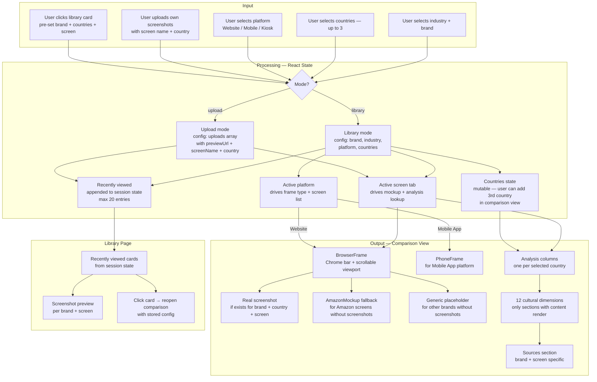

# Cross-Cultural Design

A platform that helps designers understand how digital experiences shift across cultures.

**AI 201 — Project 3: Persons Required**
**Live URL:** https://brunastefanii.github.io/CrossCulturalDesign/

---

## 1. Design Argument

### The People

This project was built for **Sagar**, a designer, and informed by conversations with **Craig**, a professor — two people whose work puts them in direct contact with the problem this tool addresses.

### Research

The insight came from a recurring concern that surfaced across multiple conversations with designers and educators: how do you design responsibly for people whose cultural context you've never lived in?

One conversation with Sagar stayed with me:

> *"I would have to go to Japan if I had to design for that audience."*

That comment revealed the core problem: designers recognize the gap exists, but have no accessible tool to help them close it. The only perceived solution was total immersion — which is not available to most working designers.

Conversations with Craig reinforced this from an educator's perspective: cross-cultural design awareness is rarely taught through direct comparison of real products. Most designers default to Western-centric mental models because that's the only reference system they've been given.

**Observed pain points:**
- Designers lack confidence when designing for audiences outside their own cultural context
- No centralized tool exists for comparing how real products actually adapt across markets
- The gap between "translation" thinking and genuine cultural adaptation is rarely named or taught

### The Problem

Global digital products are often designed through a narrow cultural lens. Designers lack a centralized system that helps them understand how — and why — digital experiences adapt across cultures.

The question this project began with:

*What if designers had a tool that helped them understand how interfaces, behaviors, and expectations shift across cultures?*

### Definition of "Helped"

Success means helping designers feel more confident and informed when designing for audiences outside of their own cultural context.

The platform helps users:

- Understand how digital behaviors and interface patterns shift across cultures
- Explore real-world examples through structured comparisons
- Recognize how culture influences trust, communication, navigation, and interaction
- Move beyond assumptions, stereotypes, and Western-centered design defaults
- Make more thoughtful and culturally aware design decisions

Success looks like helping designers move from:

> *"How do we translate this product?"*

to:

> *"How do we design experiences that genuinely fit different cultural contexts?"*

### My Qualification

As a multicultural designer who has lived and navigated different cultural environments firsthand, I've become increasingly aware of how behaviors, expectations, and communication styles shift across contexts — both in everyday life and in digital experiences. This project comes from a position I've occupied personally, not a problem I observed from a distance.

### Non-Negotiables

**Use real product examples.** The platform compares and analyzes real digital experiences to make insights practical, credible, and relatable — not hypothetical.

**Be research-driven.** Insights are grounded in behavioral research, real-world products, and cultural analysis rather than assumptions or generalizations.

---

## 2. Platform Rationale

Cross-Cultural Design lives on the web as a React application. That choice was driven by the person and the problem, not by comfort or convention.

**The user is a designer working on a screen.** Sagar and Craig both work in browser-based environments — Figma, research tabs, documentation. A web app meets them exactly where they already are. A mobile app, a desktop binary, or an installed extension would all add friction to a workflow that's already screen-based.

**The content is comparative and visual.** The core value of this tool is side-by-side comparison of real product interfaces. That experience requires a large viewport, scrollable layouts, and the ability to render multiple mockup columns simultaneously — patterns that are native to the web and would be significantly constrained on mobile.

**It needs to be shareable without installation.** Designers reference tools mid-project, send links to colleagues, and revisit resources across devices. A live URL is the right delivery mechanism — not an app store submission or a downloadable file.

**React as the rendering layer.** React's component model maps directly to the tool's structure: reusable mockup frames, swappable screen tabs, dynamic analysis columns. The stateful comparison builder (platform, brand, countries, screen) is a natural fit for React's state primitives. No framework overhead was needed — Vite kept the build lean and the dev loop fast.

---

## 3. AI Direction Log

Full session-by-session log: [`claude/checkpoints/AI-Direction-Log.md`](claude/checkpoints/AI-Direction-Log.md)

10 entries across 3 working sessions documenting what was asked, what AI produced, what was kept, changed, or rejected, and why.

---

## 4. Records of Resistance

Full log: [`claude/checkpoints/records-of-resistance.md`](claude/checkpoints/records-of-resistance.md)

Documents moments where AI output was rejected or significantly revised, including the reasoning behind each decision.

---

## 5. Post-Mortem

### What Worked

The comparison system itself was one of the strongest aspects of the project. Organizing the platform around side-by-side interface comparisons made cultural differences more visible and easier to understand — the format matched the insight. When the mockups and analysis columns came together, the value of the tool became immediately legible without explanation.

### What Failed or Didn't Go as Planned

The original intent was to display live interfaces so users could interact directly with each product being analyzed. That approach hit technical and platform constraints quickly — Amazon and McDonald's both block iframe embedding, and live scraping was inconsistent. The pivot to curated screenshots turned out to be the right call: it provided more control, more consistency, and ultimately a better comparison experience. But it required significantly more preparation than anticipated.

### What I Would Do Differently

If starting over, I would evaluate technical constraints earlier — before locking in feature definitions. The live interface idea was compelling enough that it shaped early planning, which made the pivot more disruptive than it needed to be. I would also build the screenshot library more systematically from the start, since the visual comparisons became the core of the experience and the quality of that content drove everything else.

### What I Learned About Designing for a Real Person vs. a Hypothetical User

The biggest shift was understanding how much more complex real feedback is compared to assumed feedback. Hypothetical users behave the way you need them to. Real users give feedback that is personal, sometimes contradictory, and shaped by context you didn't anticipate. The lesson wasn't to follow feedback literally — it was to treat it as signal that required interpretation. Good design decisions in this project came from balancing what users said, what the research showed, and what the design judgment called for, rather than treating any one of those as the final word.

---

## 6. Mermaid Diagram

Full system architecture — input, processing, and output.

---

## 7. User Testing Evidence

### Testers
**Craig** (professor) and **Sagar** (designer) — the two people this platform was built for.

### What Happened

After putting the prototype in front of Craig and Sagar, the most significant feedback came from the analysis section. The initial version contained Amazon-specific, narrative-style analysis blocks that didn't generalize across brands or markets.

Craig's feedback identified a gap: the analysis wasn't structured around the dimensions that actually matter to designers making cross-cultural decisions. He provided a list of what the analysis should cover:

> Layout patterns · Navigation behaviors · Color meaning · Typography preferences · Imagery styles · Interaction density · Trust signals · Payment expectations · Accessibility expectations · Social behaviors · Cultural UX heuristics

He also pushed further into the cultural and aesthetic layer — areas that are often absent from UX analysis but deeply relevant to design decisions:

> Traditional art and heritage · Color theory and cultural associations · Design guidelines around what trust looks like in different places · The relationship between Western color conventions and other cultural visual traditions

### What Changed Based on Testing

The entire analysis section was rebuilt in response to this feedback:

- Restructured from a single narrative column to **country-focused columns** — one per selected market
- Replaced 8 generic Amazon blocks with **12 cultural dimensions** covering both functional UX and cultural/aesthetic layers
- Sections only render when content exists for the selected brand and screen — no empty or irrelevant blocks
- New `src/data/analysisData.js` written with full content for Amazon Home, Amazon Product Detail, and McDonald's Home
- Sources moved to a dedicated section below the analysis columns

### What the Testing Confirmed

The comparison format itself landed well — the side-by-side mockup structure was immediately readable. The gap was in the depth and structure of the analysis, not the comparison mechanism. Testing clarified that the tool needed to go further than UX patterns into cultural theory, aesthetics, and heritage — dimensions designers rarely have access to in one place.

---

## 8. Five Questions Reflection

**Can I defend this?**
Yes. Every major design decision connects back to the core problem: helping designers better understand audiences from different cultural contexts. Features like side-by-side comparisons, real product examples, and the 12-dimension analysis framework were built specifically to make cultural UX differences visible and accessible. Each decision has a traceable reason.

**Is this mine?**
Yes. AI helped refine writing and accelerate execution, but the concept, research direction, and final decisions were mine. I did not accept AI suggestions because they looked good — I evaluated them against the goals of the project and directed accordingly. The AI Direction Log documents that process across 10 entries.

**Did I verify?**
Throughout the project I shared the work with classmates, professors, and designers — including Craig and Sagar, the people this platform was built for. Their feedback directly shaped the product: Craig's analysis on the cultural dimensions I was missing led to a complete rebuild of the analysis section. Some features remained conceptual due to time and technical constraints, but the core experience was validated through critique and direct feedback.

**Would I teach this?**
Yes. I can explain the research process, the reasoning behind the comparison system, the platform decision, and the design choices to another designer. The project has a clear architecture and every part of the experience connects back to the research and goals identified before building started.

**Is my disclosure honest?**
Yes. The idea and vision were mine from the beginning, rooted in my own experience as a multicultural designer and my interest in cross-cultural UX. AI supported the execution — writing, code, structure — but the overall direction, the design argument, and the final outcome were guided by my own thinking. The AI Direction Log and Records of Resistance accurately reflect what was asked, what was produced, and what was changed.
